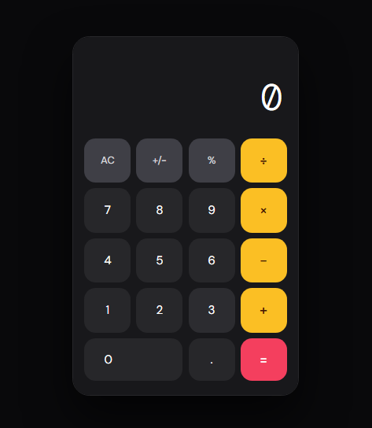
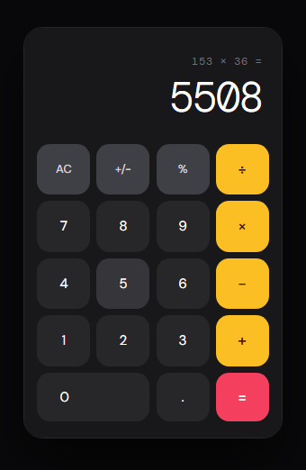
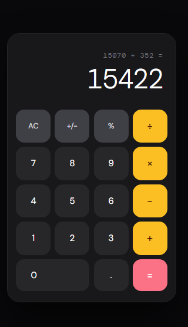

# 🧮 Simple Web Calculator

A clean, functional, and responsive calculator web application designed for simplicity and ease of use. This project was developed as a demonstration of core front-end development principles, focusing on logic implementation and responsive UI design.

---

## 📸 Project Showcases

To provide a clear view of the application across different size and calculation, here is a visual overview:

<p align="center">
  
  
  
</p>

> **Note to Educators & Students:** This repository serves as an open-source reference for students looking to understand DOM manipulation and CSS Grid/Flexbox layouts in a practical scenario.

---

## 🚀 Key Features

* **Precision Arithmetic:** Handles addition, subtraction, multiplication, and division with accuracy.
* **Responsive Interface:** Fully optimized for desktop, tablet, and mobile browsers.
* **Dynamic UI:** Real-time display updates and clear/delete functionality for a seamless user experience.
* **Clean Codebase:** Organized into modular HTML, CSS, and JavaScript files for high readability and maintainability.

## 🛠️ Tech Stack

* **HTML5:** Structured for accessibility and semantic clarity.
* **CSS3:** Custom styling utilizing modern layout techniques.
* **JavaScript (ES6+):** Logic-driven interaction and event handling.

## 📂 Installation & Usage

1. Clone the repository:
   ```bash
   git clone [https://github.com/LegaspiRonnie/simple-calculator.git](https://github.com/LegaspiRonnie/simple-calculator.git)
